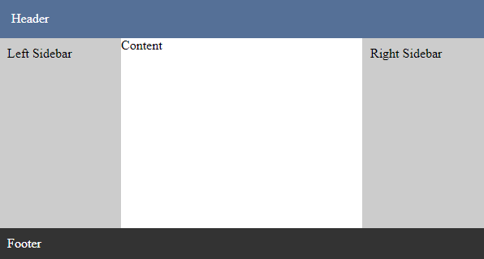
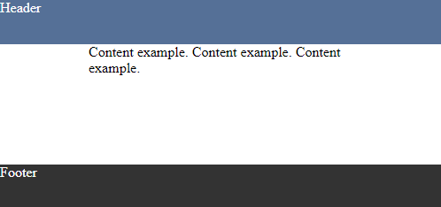

# react-html-layout

Basic react page layout.

<a href="https://www.npmjs.com/package/react-html-layout">
    
</a>

## Usage

### Installation:

```
npm install react-html-layout
```

### Make sure you have next styles

Some browsers have default styles for `html` or `body` tags. We should be sure that below tags have:

```css
html,
body {
  margin: 0;
  padding: 0;
}
```

## Glossary

- [Layout](#layout)
- [ContentWrapper](#contentwrapper)

## Layout

```jsx
import { Layout } from 'react-html-layout';
...
<Layout
    header="Header"
    footer="Footer"
    leftSidebar="Left Sidebar"
    rightSidebar="Right Sidebar">
    Content
</Layout>
```

<div align="center">
    
</div>

- `header`, `footer`, `leftSidebar`, `rightSidebar` contains default styles if content has `string` type.
- Layout occupies whole visible page space, that's because it's height is `100vh`.
- To make `header` fixed, set `fixedHeader` to `true`.
- To make `footer` fixed, set `fixedFooter` to `true`.
- To make `leftSidebar` and/or `rightSidebar` fixed, set `fixedSidebar` to `true`.

### Options

| Name                  | type            | Description                                             |
| --------------------- | --------------- | ------------------------------------------------------- |
| `className`           | `string`        | Root class name                                         |
| `style`               | `CSSProperties` | Root style                                              |
| `header`              | `ReactNode`     | Header content.                                         |
| `fixedHeader`         | `boolean`       | Toggles `header` to be fixed                            |
| `footer`              | `ReactNode`     | Footer content.                                         |
| `fixedFooter`         | `boolean`       | Toggles `footer` to be fixed                            |
| `leftSidebar`         | `ReactNode`     | Left Sidebar content                                    |
| `leftSidebarStyle`    | `CSSProperties` | Left Sidebar style                                      |
| `rightSidebar`        | `ReactNode`     | Right Sidebar content                                   |
| `rightSidebarStyle`   | `CSSProperties` | Right Sidebar style                                     |
| `fixedSidebar`        | `boolean`       | Toggles `leftSidebar` or/and `rightSidebar` to be fixed |
| `content`, `children` | `ReactNode`     | Content of the page                                     |

## ContentWrapper

Centralized content with fixed width

```jsx
import { ContentWrapper } from 'react-html-layout';
...
<ContentWrapper width={300}>
    Content example. Content example. Content example.
</ContentWrapper>
```

<div align="center">
    
</div>

### Options

| Name       | type        | Description          |
| ---------- | ----------- | -------------------- |
| `width`    | `number`    | Width of the content |
| `children` | `ReactNode` | Content              |
